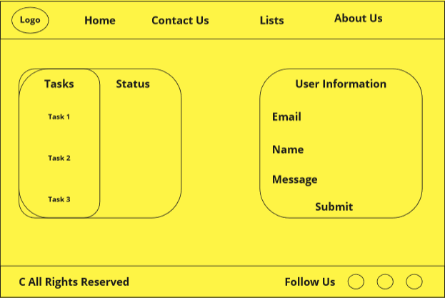

# todo-project

# The purpose of this WebPage

The Easy ToDo List website is a simple yet effective tool for managing your daily tasks. The website has a clean and user-friendly interface that allows users to easily add tasks as needed.

# Description

On the home page, users are presented with a table that displays all of their tasks, including the task name, and status. The table has a check box, so users can quickly see which tasks are complete and which ones still need to be done.

> To add a new task, users simply need to click on the "Add Task" button and fill out the form with the task name, and status.

The website also includes a static Contact Us page where users can provide their contact information and send a message to the website's administrators.

Overall, the Easy ToDo List website is a useful tool for anyone looking to better manage their daily tasks in a simple and intuitive way.
# About the Developer
As the developer of the To-Do WebPage, I am **Al-mothana Al-masri**, a power engineer who is currently studying at LTUC in a Python training program aiming to be a full-stack engineer inshAllah.

